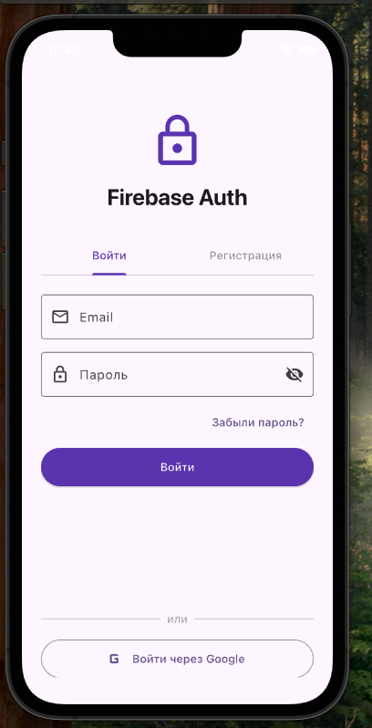
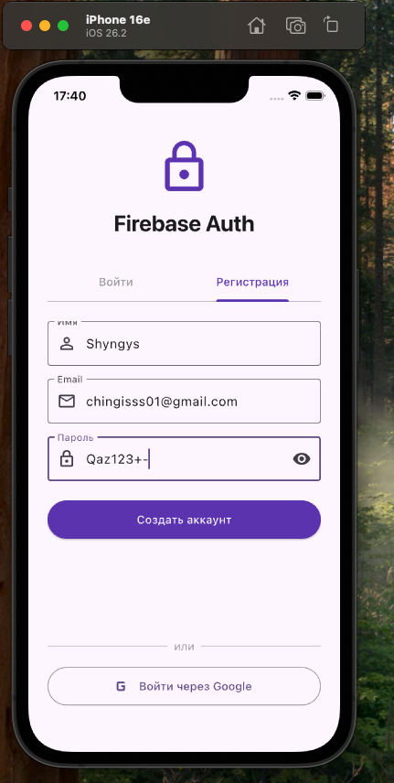
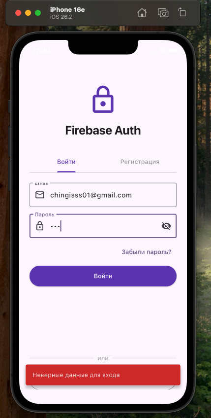
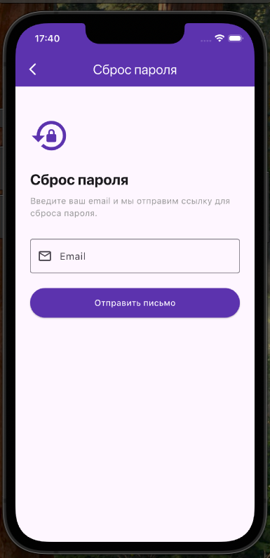
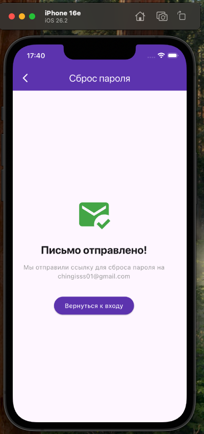
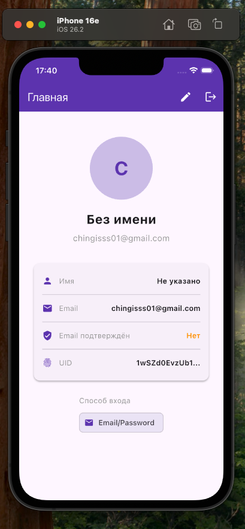

# HW32 — Firebase Auth

Flutter приложение с полноценной авторизацией через Firebase Authentication.

## Функционал

- Регистрация по email/паролю
- Вход по email/паролю
- Google Sign-In
- Автоматическая смена экранов через `authStateChanges()`
- Обработка ошибок с понятными сообщениями
- Индикатор загрузки
- Сброс пароля (forgot password)
- Защита маршрутов (если не авторизован → экран логина)
- Профиль пользователя (displayName, photoURL)
- Редактирование профиля
- Выход из аккаунта

## Скриншоты

### Вход


### Регистрация


### Ошибка входа


### Сброс пароля


### Отправка письма


### Профиль


## Структура проекта

```
lib/
├── main.dart                       # Firebase init + StreamBuilder (authStateChanges)
├── services/
│   └── auth_service.dart           # Вся логика авторизации
└── screens/
    ├── auth_screen.dart             # Экран входа/регистрации (TabBar)
    ├── forgot_password_screen.dart  # Сброс пароля
    ├── home_screen.dart             # Главный экран с профилем
    └── edit_profile_screen.dart     # Редактирование профиля
```

## Технологии

- Flutter
- Firebase Core
- Firebase Authentication
- Google Sign-In

## Запуск

1. Создать проект в [Firebase Console](https://console.firebase.google.com)
2. Включить Email/Password и Google в Authentication → Sign-in method
3. Установить FlutterFire CLI: `dart pub global activate flutterfire_cli`
4. Настроить проект: `flutterfire configure`
5. Запустить: `flutter run`
